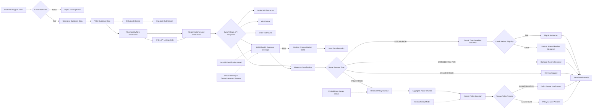

# Northstar Retail — Mermaid

```mermaid
flowchart LR
    A["Customer Support Form"] --> B{"If:Validate Email"}
    B -- False --> C["Reject Missing Email"]
    B -- True --> D["Normalise Customer Data"]
    D --> E["Valid Customer Data"]

    E --> F["If:Duplicate Exists"]
    E --> G["If:Completely New Submission"]
    F --> H["Duplicate Submission"]

    G --> I["Order API Lookup Data"]
    G --> J["Merge Customer and Order Data"]
    I --> J

    J --> K{"Switch:Route API Response"}
    K --> L["Invalid API Response"]
    K --> M["API Failure"]
    K --> N["Order Not Found"]

    K --> O["LLM:Classify Customer Message"]
    K --> P["Merge AI Classification"]
    O --> P
    O -. Error .-> Q["Review: AI classification failed"]
    Q --> R["Save Data Records1"]

    P --> S{"Route Request Type"}

    S -- REFUND PATH --> T["Date & Time: Deadline calculator"]
    T --> U{"Check Refund Eligibility"}
    U -- True --> V["Eligible for Refund"]
    U -- False --> W["Refund: Manual Review Required"]
    V --> X["Save Data Records"]
    W --> X

    S -- DAMAGED ITEM PATH --> Y["Damage: Review Required"]
    Y --> X

    S -- DELIVERY PATH --> Z["Delivery Support"]
    Z --> X

    S -- POLICY PATH --> AA["Retrieve Policy Context"]
    AB["Embeddings Google Gemini"] -.-> AA
    AA --> AC["Aggregate Policy Chunks"]
    AC --> AD["Answer Policy Question"]
    AE["Gemini Policy Model"] -.-> AD
    AD --> AF{"Review Policy Answer"}
    AF -- "NO INFORMATION" --> AG["Policy Answer Not Present"]
    AF -- "Answer found" --> AH["Policy Answer Present"]
    AG --> X
    AH --> X

    AI["Gemini Classification Model"] -.-> O
    AJ["Structured Output Parser:Intent and Urgency"] -.-> O
```
